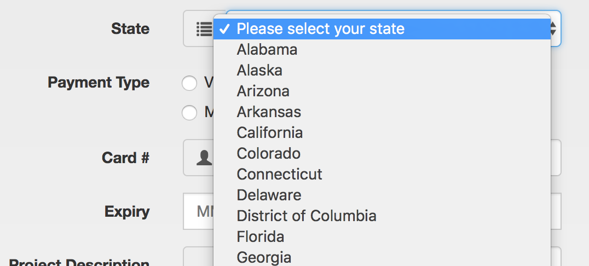
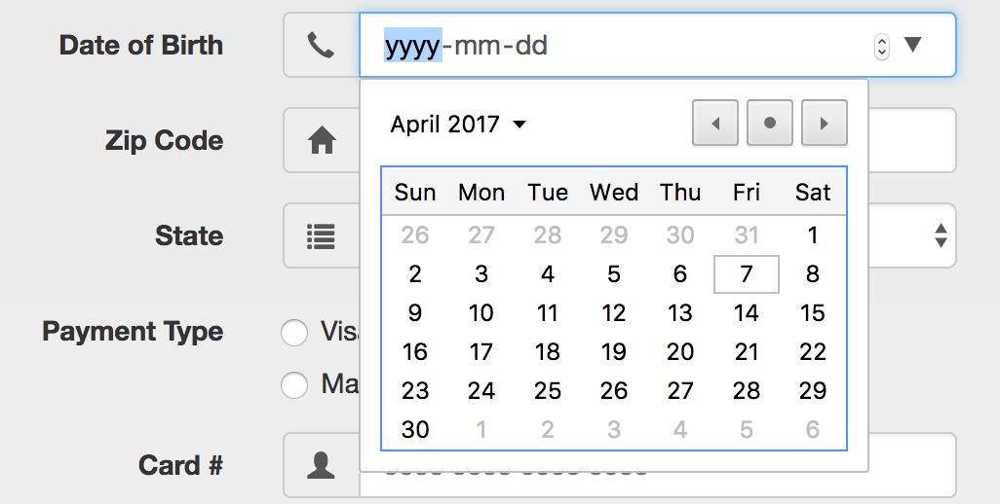

# Media Queries/Bootstrap/Flexbox Self Directed Examples

- **All videos have the password `horizonites`**
- Before you jump in
- Keep [lesson slides](http://lessons.horizonsbootcamp.com/lessons/week02/day2.html)
  open in your browser. Lesson slides contain code samples and links to
  essential documentation.
- You can write all your solutions in the same project. You don't need to
  create a new React Native project for each secion.
- Ask for help early and often! 🙋

## Section 1: [Media Queries](https://developer.mozilla.org/en-US/docs/Web/CSS/Media_Queries/Using_media_queries)

### [Watch me](https://vimeo.com/208401683)

Open [http://codepen.io/moose-horizons/pen/YNQjvq](http://codepen.io/moose-horizons/pen/YNQjvq) and
use media queries so that the three elements are laid out responsively as per the instructions.

Check out the [live, working version][live].

Tips:
- Fill in the empty media queries in the CSS section.
- You can achieve this entirely using CSS and media queries, you don't
  need to modify the HTML.
- Make changes in Dev Tools first to see what works! You can make your
  browser window wider or smaller to view the page with different screen
  sizes.

[live]: http://horizons-school-of-technology.github.io/week02/day2/warmup/solution/index.html

## Section 2: [Flexbox](https://css-tricks.com/snippets/css/a-guide-to-flexbox/)

### [Watch me: Growing & Shrinking](https://vimeo.com/208556243)

1. Display the items in three evenly sized columns, like this:

    Codepen: [http://codepen.io/prath/pen/aJrGgx](http://codepen.io/prath/pen/aJrGgx)

    ![flex-sizing]

1. Change your code in the above codepen for the `.item1` CSS class to make it 5 times as large as `item2`. It should look like:

    ![flex-ratio]

### [Watch me: Centering](https://vimeo.com/208572816)

Center the three items (vertically and horizontally) inside the container.

Codepen: [http://codepen.io/lockehart/pen/XKmKMP](http://codepen.io/lockehart/pen/XKmKMP)

### [Watch me: Flexbox inside Flexbox](https://vimeo.com/208581685)

Using the below codepen, recreate the layout from this image using FlexBox:

Codepen: [http://codepen.io/lockehart/pen/EyVyRM](http://codepen.io/lockehart/pen/EyVyRM)

![flex]

## Section 3: [Bootstrap](http://getbootstrap.com/css/)

### [Watch me: Bootstrap Installation & Grid](https://vimeo.com/208747027)

The three boxes should be on the same line. Change __ONLY__ the `HTML`.

Codepen: [http://codepen.io/prath/pen/qrGKyN?editors=1010](http://codepen.io/prath/pen/qrGKyN?editors=1010)

### [Watch me: Responsive Grid](https://vimeo.com/208754060)

Use the Bootstrap responsive grid to change the layout of the page based on the screen size (specifications outlined in the codepen). Change __ONLY__ the `HTML`.

Codepen: [http://codepen.io/prath/pen/NpVzLL?editors=1010](http://codepen.io/prath/pen/NpVzLL?editors=1010)

### [Watch me: Icons & Buttons](https://vimeo.com/208866726)

Go to the __Forms__ section on the Bootstrap website ([https://v4-alpha.getbootstrap.com/components/forms/](https://v4-alpha.getbootstrap.com/components/forms/)), and create a Bootstrap form that looks like the form below.

Work in the `/week02/day2/Examples/bootstrap_form/index.html` file.

![bootstrap_final]

__Note:__ Make sure that your _Date of Birth_ field is a date picker, and that your state picker is a dropdown.

  

    

    

  

### [Watch me: Dropdown, Navbar, & Modals](https://vimeo.com/209247462)

[flex]: ../images/flex.png
[flex-sizing]: ../images/flex-sizing.png
[flex-ratio]: ../images/flex-ratio.png
[bootstrap_final]: ../images/bootstrap_form_final.png
