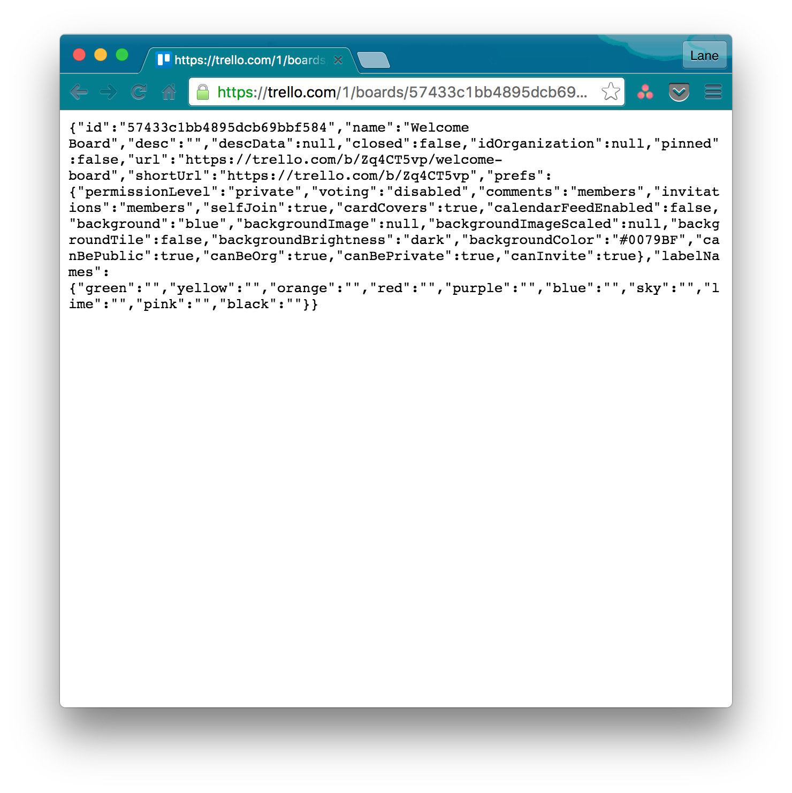

# Horello continued: APIs and AJAX

## Contents

- Phase 1: [Authentication](#phase-1-authentication)
- Phase 2. [Getting familiar with the API](#phase-2-getting-familiar-with-the-api)
- Phase 3. [Serialization/deserialization](#phase-3-serializationdeserialization)
- Phase 4. [Reading from the API](#phase-4-reading-from-the-api)
- Phase 5. [Writing to the API](#phase-5-writing-to-the-api)
- Phase 6. [(BONUS) Improvements](#bonus-phase-6-improvements)

## Introduction

Remember the first time you left home? Like, ventured out into the real,
big, scary world to meet other people and find yourself and figure out
where you fit in? Hopefully you didn't get punched in the face or fall
off a cliff. (I did `¯\_(ツ)_/¯`)

Today is a big day. You're a grown up (more or less), but your app
isn't. Up to now, your app has been sitting pretty on a comfy sofa in
the living room, drinking Coke and watching football. Pretty much. But
Today your app is about to walk out the front door.

After this morning's lesson, you now have the tools--namely, JSON, AJAX,
and APIs--that you need to connect your app to the big bad world. Today,
your app is going to do something _persistent._ It's going to touch data
in the real world. Exciting, right? (And you're going to have to find a
way to deal with the empty nest when it's gone. Time to make another
one?)

You're going to be starting with the solution code from the previous
Horello project (Making Horello Dynamic). We've simplified the code a
bit, and removed some of the comments. If you prefer to work with your
own code from the previous project, feel free to do that instead, we
won't be offended. You won't be changing the view code (HTML/CSS) today,
this will be pure JS.

Check out the [live, final version of Horello at the end of this
project](http://horizons-school-of-technology.github.io/week02/day4/2_horello-ajax/solution/index.html).

## Phase 1: Authentication

The "real world" that we're going to be venturing into today is the
cloud, i.e., someone else's data server out there somewhere in the
Internet. Before we can do anything in the cloud, or on someone else's
server, and before we can use someone else's API, we first need to
authenticate ourselves. Authentication is like sticking a "Hello, my
name is..." badge on our chest before we ask for data. The other guy is
going to want to know who you are. (Why? Permissions, throttling, etc.)

Step one today is to establish your credentials with Trello--since we're
going to be working with the Trello API.

Head over to http://www.trello.com and log in to your Trello account. If
you don't yet have a Trello account, create one first by clicking "Get
Started" (that beautiful button that you spent so long styling on
Monday...).

Once you've logged into your Trello account:

1. Navigate to the [Trello
   Developers page](https://developers.trello.com/get-started/start-building).
1. Click the `Get your Application Key` button in the first section of
   the page. Copy this key and paste it into `config.js` (you'll see
   where).
1. Generate a token manually by clicking on the `Token` link on that page.
1. Click "Allow" on the authentication screen.
1. Copy this token and paste it into `config.js`.

That was pretty easy, right? These two strings--the key and the
token--are how our application (Horello) authenticates to the Trello
backend. It's how Trello knows which boards, lists, and cards we have
access to, and it's how Trello knows whose pretty face to attach to our
comments.

## Phase 2: Getting familiar with the API

With authentication in place, we can begin having some fun with data.
Before we try to hook up our frontend to the Trello backend, let's test
the API to make sure a.) that it's working and b.) that we know what the
heck is going on.

Begin by taking a look at the full [Trello API
reference](https://developers.trello.com/advanced-reference). The panel
on the left lists the _resources_ that are available via this
API--things like _board_, _card_, and _list_. (These should look very
familiar by now, but in an API, they're called _resources_ rather than
_classes_.) If you click on one of these resources, you'll see a full
list of the actions that you can take on each of them.

For instance, [GET
/boards/BOARD_ID](https://developers.trello.com/advanced-reference/board#get-1-boards-board-id)
is how we download the metadata for one board from the API. Similarly,
[POST
/cards](https://developers.trello.com/advanced-reference/card#post-1-cards)
is how we create a new card. Recall from class that the four HTTP
actions--POST, GET, PUT, DELETE--correspond to the four CRUD
actions--create, read, update, delete. POST creates a new object (and
usually returns its ID), PUT updates an existing object, GET fetches an
existing object, and DELETE, well... you get one guess.

We're going to be using a few of these API calls in this project so
spend some time getting familiar with them. There are a number of tools
that we can use to test the API. We'll see several of them here.

### Sandbox

Trello gives us a cool sandbox tool that we can use on its developer
site to play around with the API and begin viewing data. Navigate to
https://developers.trello.com/sandbox to check it out. You'll need to
enter your API key here as well. Enter it, then tap Authenticate on the
next screen to kick off the authentication process.

Once you're in the sandbox, play around with the different examples to
see what shows up in the Result box on the right. This is the JSON data
that your app will be receiving from the Trello API. Cool, right?

The most important thing we need is a board ID that we can use in
Horello. We need to hardcode this board ID somewhere since our app is
(so far) only designed to work with a single board. If you tap on Get
Boards on the left, then tap Execute, you should see a list of boards
appear on the right. There's a bunch of data here, but look for the
board called "Welcome Board", and copy the value from its "id" property.
You'll need to use this in the next phase.

### Raw JSON

Another trick we can use is to view the raw JSON data for an object in
our web browser. This is possible because the entire Trello API is
available via HTTP, i.e., the protocol that's being used under the hood
to exchange data between the frontend and the backend is actually HTTP,
which is the same protocol that's used for web pages. The URL you need
to view the data for a board in Trello is:

    https://trello.com/1/boards/<BOARD_ID>

Copy and paste this URL into your web browser, then replace `<BOARD_ID>`
with the ID you copied above. Hit enter, and you should see some JSON
data which looks something like this:

You can do this for cards and lists, too. Give it a shot!

### jQuery AJAX

jQuery comes with a powerful function called
[`.ajax()`](http://api.jquery.com/jquery.ajax/) that we can use in the
browser console to test the API. ([This
doc](http://www.w3schools.com/jquery/ajax_ajax.asp) is also very
helpful.) Let's try reading the list of boards (which you saw in the
sandbox) using the ajax function. It takes a URL and an object with a
list of settings. The simplest GET command would look like this:

    $.ajax('https://api.trello.com/1/member/me/boards')

This will perform a GET on the specified resource (`/member/me/boards`).
Try running this command in the console and see what happens. You should
see a 400 error appear. This error is appearing since we haven't
authenticated! Let's try the same request again, this time including the
key and token we got above. We can pass these as a `data` parameter in
the options argument to `ajax`. In this case it should look like
(replace `[APP_KEY]` with your Trello app key and `[TOKEN]` with your
token):

    $.ajax('https://api.trello.com/1/member/me/boards', {
      data: {
        key: [APP_KEY],
        token: [TOKEN],
      })

This time, you should see something like the following in the console:

    > Object {readyState: 1}

It worked! The final step is to pass a success callback into the ajax
function so that we can work with the returned data. (Why do we need a
success callback? Why can't we just use the return value of the `ajax`
call? Because the return value of the `ajax` call isn't what you think
it is. Read [the docs](http://api.jquery.com/jquery.ajax/) to see if you
can figure out what it returns.)

Call `$.ajax` one more time like this:

    $.ajax('https://api.trello.com/1/member/me/boards', {
      data: {
        key: [APP_KEY],
        token: [TOKEN],
      },
      success: function(data) { console.log(data[0]) }
    })

This time you should see something which looks like this:

    > Object {name: "Welcome Board", desc: "", descData: null, closed:
    false, idOrganization: null…}

This API call returns a _list_ of boards, so we can peek at `data[0]` to
see the first board. This data should look just like what you saw above
inside the Trello sandbox and the JSON data you saw in the browser.

Now try using `$.ajax` to create a list and a card. Then reload the
official Trello website to see your changes appear! (Actually, these
changes should appear in realtime if you have the board open--no
reloading necessary.)

### REST client (optional)

The most powerful tool we can use to play around with an API manually is
something called a REST client. Our favorite free REST client, which is
available both as a standalone app and as a Chrome plugin, is
[Postman](https://www.getpostman.com/).

If you prefer using an app, try installing Postman and using it to get
the list of boards. Then try using it to create a new list on the board,
and/or a new card on a list. Then reload the official Trello website to
see your changes appear! (Actually, these changes should appear in
realtime if you have the board open--no reloading necessary.)

You'll have to figure out how to use Postman on your own, but it's
pretty intuitive. To fetch data, run a GET query on the resource URL.
Pass `key` and `token` as params. You should be able to create data
using POST.

## Phase 3. Serialization/deserialization

Recall from class that JSON is a standard data format that's used to
exchange information via APIs. Serialization refers to turning our data
objects--our lists and cards--into JSON for sending "over the wire,"
i.e., into the cloud via the API. Deserialization is the opposite
process: reading JSON data and turning it into the objects that we're
used to working with (this process is called _deserialization_).

Now that we know what the data we're getting from the API looks like,
let's write some deserialization methods for our objects so that we can
turn the data we pull from the API into data that we know how to render
and work with. Open up `data_model.js` (this file should look familiar!)
and fill in the `.fromJSON()` methods of the Card and List classes to
accomplish this.

You may decide, in phase 5 (writing data to the API), that you need to
do something similar in the opposite direction, i.e., that you need
methods that serialize your instances into JSON data. Or you might
decide that you don't need them.

Note that these two methods are _static methods_. A static method is not
called on any particular _instance_ of the class, so it does not receive
a `this` variable. All of its inputs must be explicitly passed in as
variables. In this case, we are _creating a new object_ from JSON data.
It's the job of the static method to create and return the corresponding
object. You can read more about [static
methods](https://en.wikipedia.org/wiki/Method_(computer_programming)#Static_methods)
on Wikipedia.

## Phase 4: Reading from the API

Let's pause to recap where we are. We have access to the Trello API, and
we've used it to read and write data manually. We have an app that can
read JSON data and turn it into objects that we can render. Any guesses
what the final couple of steps are?

Ask Ethan for a delicious PB&J sandwich? Ask Serry for some of that
chicory coffee? (Actually, that doesn't sound like a bad meal...)

Close. Actually, we still need to wire up our app to the API so that we
can read data from the cloud, and write our changes back to the cloud.
This is the most important part of this project, so let's get started.

We love you--you should know that by now--but you're on your own for
this part. It's your time to fly, butterfly. Here are some hints to get
you on your way:

- You should be working in `data_model.js`. You shouldn't need to modify
  the HTML, CSS, or events code.
- You should use `$.ajax()` for all of your AJAX calls. They should look
  like this:

      $.ajax(URL, {
        data: {
          key: API KEY,
          token: API TOKEN,
          [ other data here as necessary for PUT and POST ]
        },
        success: SUCCESS CALLBACK,
        error: ERROR CALLBACK
      }

- ***Make sure you include the API key and token with every single AJAX
  call!*** See the previous item.
- Where, and how, do we want to download the board data from the API so
  that we can display it to the user when they open our app? Where do we
  store the board ID that we grabbed in the previous phase, and how do
  we retrieve this board data when the app loads?
- Think carefully about where IDs come from. Plugging into an API
  changes this a bit.
- Think about how you want to handle errors. Do something reasonable.
- The Trello API only returns _metadata_ for the resource. For instance,
  if you GET a list, you'll get back that list's name and ID, but you
  won't get back the list of cards it contains. You'll need to make a
  separate API call for that.
- Think carefully about how to structure your API calls, and about what
  order you do things. For example, when loading the lists for a board,
  where do we get the list data? What about the card data? At what point
  can we add the cards to the list, and the lists to the board? How do
  we know that one asynchronous operation--e.g., reading the list of
  lists--has completed before trying to do something with that data?
- Think about where, and when, you need to re-render the board.
- The function signatures (i.e., the list of arguments they accept and
  what they return) for some of the data model methods might change.
  This might be okay. How do we know whether it's okay?

Once you're successfully reading list and card data from the Trello API,
reload the page--_et voila!_--you should see more or less the same thing
you see in the official Trello app at Trello.com. Cool beans!

## Phase 5: Writing to the API

Take a deep breath, because you made it to the final phase of this
killer project. There's a light at the end of the tunnel. It's a tiny
light, and it's a really, really long tunnel, but it's there. Move
towards the light.

You're successfully consuming data from the Trello API. The final, final
step (aside from all those bonus steps below, ignore them for now) is to
write our changes back to the API so they persist in the cloud. You're
on your own for this part, too. Here are a couple more tips:

- Think carefully about the data flow when creating a new list or a new
  card. Do you create the object locally first, in memory, or do you
  create it using the API first? What are the potential advantages and
  disadvantages of each of these design choices?
- Do you have to create data both locally and using the API?

With this last phase in place, you can officially call yourself an app
developer. That's it. I'm out of funny things to say. See you at
graduation. :drops mic:

## BONUS: Phase 6: Improvements

:picks mic up again:

Okay, you're an ambitious grasshopper. We like ambition 'round these
parts. Well, there's still a bunch of things you can do to make this
here app as smooth as an armadillo's backside:

- Rather than passing the authentication information with every single
  request, see if you can simplify this using
  [jQuery.ajaxSetup()](https://api.jquery.com/jquery.ajaxsetup/).
- You're probably rendering (i.e., calling `horello.mount`) more often
  than you need to. Try to optimize how often you render the board, and
  don't do it more often than necessary, to improve performance.
- Trello automatically detects when the data changes, and displays those
  changes immediately, without needing to reload. Add that. Boom.
- Add support for multiple boards.
- AJAX calls are expensive. Think about how you can minimize the number
  of API calls you're making.
- Replace your nasty callback code with sexy new
  [Promises](https://developer.mozilla.org/en-US/docs/Web/JavaScript/Reference/Global_Objects/Promise).
- Looking for even more? Check out the [list of challenges for the
  week](../../challenges/1_bonus_horello).
