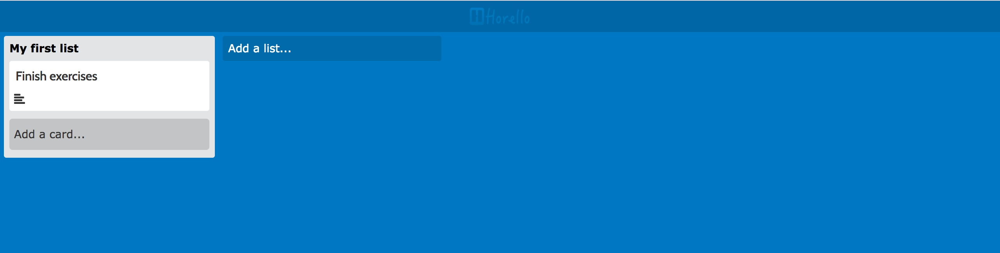
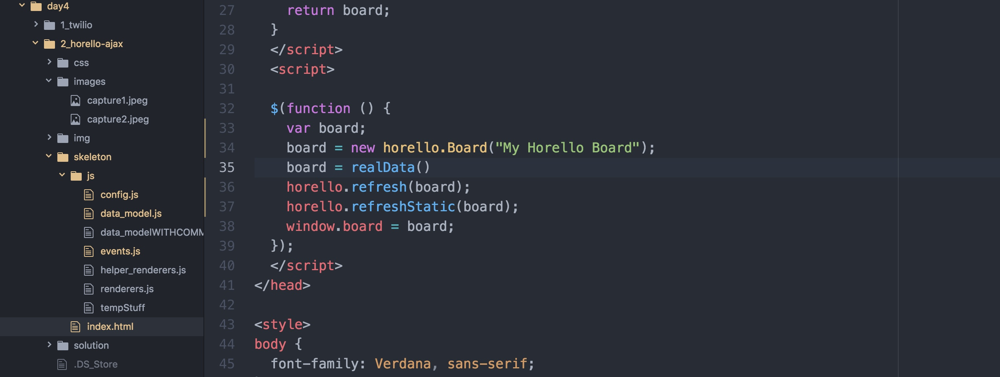

# Horello continued: APIs and AJAX

## Introduction

Up to yesterday, you created a functioning version of Trello in HTML. You can add
cards, but they will get deleted once the webpage is reloaded. Today, we are going
to use the Trello API as a backend for our app to store all our data.

Every action like `adding a card` or `changing a title` needs to be sent to the
backend now, so it can save our changes. If a user deletes a card, we have to remove
it from our front-end and from the backend too, making a DELETE request to the API.

To get an idea on how the project works, visit the final version of the project [here](http://horizons-school-of-technology.github.io/week02/day4/2_Horello-ajax/solution/index.html).

# Section 1

## Step 1: Warmup

To start, we are going to create some data on the console and display it onto the
board. Open `index.html` and the console.

Paste the following code into the console. This creates a list with "id" of "1"
and the name "My first list".

```javascript
var list1 = new horello.List("1", "My first list");
```

Now, you have to specify that our list belongs to our board. So let's push it into
the `board.lists` array that contains all the lists on our board.

```javascript
board.lists.push(list1);
```

Finally, refresh the board to see the newly added list. This should display your
board to the screen. Every time we make a new change, we need to refresh our screen
with this command to see it working.

```javascript
horello.refresh(board);
```

If everything went ok, this is what you should see:


Now that we have a list, we want to add a card to it. We follow a similar process
to add a card to the list. First, we have to create the card. The card takes in
a cardId, cardName, description, and list id. Then we have to push it into our list,
adding it to the list's `card array`, and re-render to display it.

```javascript
var card1 = new horello.Card("1", "Finish exercises", "Finish doing memoize.");
list1.cards.push(card1);
horello.refresh(board);
```

This is how your board should look now.



Try adding more lists and cards into your console and displaying them to the board.
Don't forget to push the newly created lists into the board by doing `board.lists.push(list1);` and cards to lists by doing `list1.cards.push(card1);`
Refresh the board `horello.refresh(board);` every time you add a new card.

We have setup all the logic that takes the board, lists and cards and shows them
up on the screen so you can focus on getting data back and forth from Trello with
ajax. Whenever you do a request and get data for cards, follow the same process
of creating a `new Card` adding them to the list, and so on.

We added a couple more cards to out board and this is the result we got.


Ready to start working? head over to `index.html` and un-comment the line that
says `board = realData()` your code on `index.html` should look like this:



## Step 2: Setting up Trello

To be able to use Trello and save your board data to their backend, you need to
create an account, and get a `KEY` and `TOKEN` for our application. This allows
Trello to know what boards your app has access to.

1. Head over to http://www.Trello.com and sign-up/log-in to your Trello account.
1. Navigate to the [Trello
   Developers page](https://developers.Trello.com/get-started/start-building).
1. Click the `Get your Application Key` button in the first section of
   the page. This gives you an identifier for your app. Now, Trello knows that key
   will try to access their backend. Copy this key and paste it into `config.js` in the appropriate spot: `horello.apiKey`.
1. Generate a token manually by clicking on the `Token` link on that page. This allows
   Trello to verify that your app is making the request and not someone else.
1. Click "Allow" on the authentication screen.
1. Copy this token and paste it into `config.js` into `horello.apiToken`.

TODO. PICTURES.

**Creating test data**
1. Head back to http://www.Trello.com
1. Create a new board and add some lists and cards to it.

TODO ADD PICTURE OF THIS Step

1. Copy the URL from your browser. The current url you are on should looks something like this `https://Trello.com/b/xFsMS0DK/Trello-test`
1. Add .json at the end of that url. To make it `https://Trello.com/b/xFsMS0DK/Trello-test.json` And you will see a result like this on your browser.

  
  The output could look a bit different.

1. Copy the id for the board and paste it into `config.js` in `Horello.boardId`.

## Step 3: Getting familiar with the API

We are finally ready to make requests and get data for the boards. This is how a
GET request would look like to get information for a board.

```
$.ajax('https://api.Trello.com/1/boards/YOURBOARDIDHERE', {
      data: {
        key: "ac960adda2eff64acbbd98e795c025ca",
        token: "4f056833805f0d9f9942665e386fb731be47e335e7b9a32a5abb87e1e2ea8125",
      },
      success: function(data) { console.log(data) }
    })
```

That request would return an object like the one below, containing all the information
about the board, including its id, name, description and much more.

```
{
  "id":"588577bb8423080722cabe8c",
  "name":"Trello Test",
  "desc":"",
  "url":"https://Trello.com/b/xFsMS0DK/Trello-test",
  "shortUrl":"https://Trello.com/b/xFsMS0DK",
  "prefs":{}
}
```

You can use the code above as a base for all the requests you are going to make.
Remember to replace the `TOKEN` and `KEY` when actually using the code.


Now let's start to code! Head on to the `data_model.js` file and **implement** the
following methods using ajax to get the information:

- `Horello.List.prototype.getCard`
- `Horello.Board.prototype.getList`

The comments on `data_model.js` give you more information on how to do it.

If you need help implementing these methods head over to [Trello API
reference](https://developers.Trello.com/advanced-reference). For more info on how
the API works.


### From AJAX to models.

**Implement** The following methods. `Horello.Board.boardFromJSON` to get an idea of how they should work.

`Horello.List.listFromJSON`
`Horello.Card.cardFromJSON`

These methods are used to convert the JSON you get from the API into actual objects
on your code. They should do the same thing we did on the `Warmup` section when
we created all the objects doing `new horello.List()`. They should take in data
and return the newly created `list` object.

## Step 4: Sanity Check.

This is just a quick review on how things are (or should be) working on the app to get the data from our backend (Trello API) and rendering into the frontend.

If your methods were correctly implemented according to the steps here and on
`data_model.js`, refreshing your page should show you Horello with all the data
you had on the real Trello board. If something went wrong along the way, or if you
want to understand how the data comes from the API and ends up in the page, these
are the steps your code should be taking.

1. Our `index.html` calls `board.loadData();` This method should:
    1. Do an ajax call to the API to bring the 'data' for all the lists.
    1. Call `Horello.List.fromJSON(data)` for each list in the `data`.
        The method `Horello.List.listFromJSON(data)` should convert and return each list data into a `List` object.
    1. Push each `List` object into the board's list array -> `board.lists`
    1. Call `list.loadCards` for each list in the board's list array
1.  `list.loadCards()` should:
    1. Bring an array of cards for that list.
    1. Call `Horello.Card.cardFromJSON` to create Cards from data.
    1. Push the `Card` objects into the list's card array. For example:
       `this.cards = data2.map(Horello.Card.fromJSON)`
    1. Call `Horello.refresh(board);`
1. When `Horello.refresh(board);` is called, it tells our code to re-render everything
using the data that is in our models. Every time our model changes, we should call
this method to update the UI. Head over to Trello.com and edit your board. Refresh
the Horello page and you should see your changes!


## Step 5: Writing to the API

If you can see all the lists and cards on your Horello board, you are ready to start implementing your AJAX calls to perform new actions on the API. Now, we are going implement the code that allows you to edit a card's title and description.

Whenever someone clicks on a card, a modal shows up. If you edit the card and click
on save, `updateCardTitle` and `setDescription` are called. You have to implement
them to make the request to Trello and update the title on the backend.

`horello.Card.prototype.updateCardTitle` Should make a PUT request to the '/cards' endpoint to update the card's title. Don't forget to modify the current card doing  `this.title = titleStr;` so your interface also refreshes!


`horello.Card.prototype.setDescription` Same concept as above.

Now, you are going to implement similar functions that do an API request and refresh the
page when the ajax request ends in success.

`horello.Board.prototype.addList` Whenever a list is added, this function is called.
You should make a POST request to create a new `List` on the backend. On the success callback of this function, remember to call `this.loadListData();` so the lists are refreshed and your new list shows up on the page.

`horello.List.prototype.addCard` Same concept as above.


## BONUS: Step 6: Improvements

These are some of the things that need to be improved in Part 1:
- Rather than passing the authentication information with every single
  request, see if you can simplify this using
  [jQuery.ajaxSetup()](https://api.jquery.com/jquery.ajaxsetup/).
- Add server polling. Whenever you change things in the real Trello, they won't
show up on Horello if you don't refresh the page. Add `polling` which means that
every once in a while, you check the server for new content and update your app.
- Handle errors when calling the API. What happens if you update the text and the
  request fails? Does the card show the previous text? Does it show the updated one,
  even if a refresh will return to the original text? and so on.


# Section 2: Rendering

Remember how on warmup we created our lists by doing `var list1 = new horello.List("1", "My first list")`? Now we are going to implement the code that does this. By doing `card.render()`, you will generate all the needed HTML for that card.

Head over to `renderers`, un-comment the file and start rendering!

## SUPER BONUS
You are on your own now. From HTML all the way to the backend you are going to make
the connections to make the code work. We will give you a couple of hints on how
you can do this.
- Delete card. To be able to delete a card, you should follow these steps:
    1. Add an [X] button to the right upper corner of each card.
    1. Add a listener for that button, so when a user clicks it, it triggers a function   `card.delete();`
    1. Define and the function `horello.Card.prototype.deleteCard` on your `data_model.js` file. This one should make the DELETE request to the Trello API.
    1. Refresh your data so the card disappears.
- Delete list. This one should work similarly to the previous one.
- Move card between lists
    1. To move a card between lists you have to make two requests. One to remove the
    card from the actual list, and one to add it to the newly specified list.
- Move a card inside the list.
