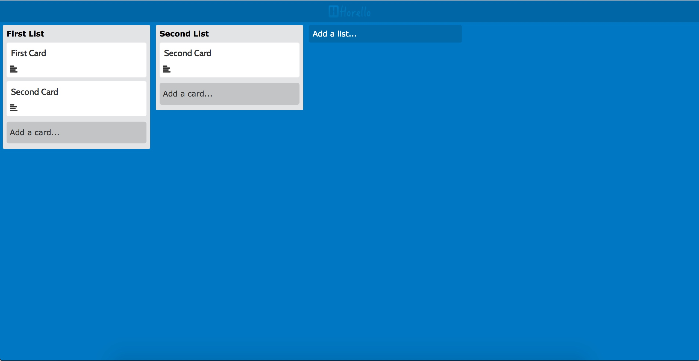
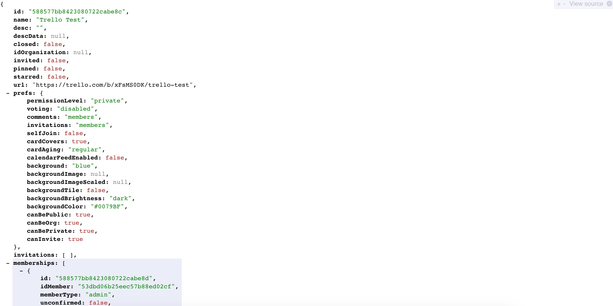

# Horello continued: APIs and AJAX

## Introduction

Today you are going to make your Horello work with the real Trello API to get and
store your data. You are going to use `ajax` to get and send data back to the API.
You can check the final version of the project [here](http://horizons-school-of-technology.github.io/week02/day4/2_Horello-ajax/solution/index.html).

## Contents

- Step 1: [Authentication](#step-1-authentication)
- Step 2. [Getting familiar with the API](#step-2-getting-familiar-with-the-api)
- Step 3. [Serialization/deserialization](#step-3-serializationdeserialization)
- Step 4. [Reading from the API](#step-4-reading-from-the-api)
- Step 5. [Writing to the API](#step-5-writing-to-the-api)
- Step 6. [(BONUS) Improvements](#bonus-step-6-improvements)

# Section 1

## Step 1: How the project works.

To start, we are giving you the models that make up Trello: `board`, `list` and `card`,
These are simple JS objects that can be created using `new`. On this project, the
data you load on your models shows up on the screen. To try this out head over to `skeleton/index.html` to the `dummyData` function and create a couple of objects there.  
Don't forget to push `cards into the lists` and `lists into the board`. Otherwise you wouldn't know what cards belong to each list and so on.

This is an example of our code for creating a couple of lists and cards.

```javascript
var board = new Horello.Board("board1");
var list1 = new Horello.List("li1", "FirstList");
var list2 = new Horello.List("li1", "FirstList");
var card1 = new Horello.Card("ca1", "firstCard", "desc", "li1");
board.lists.push(list1);
board.lists.push(list2);
list1.cards.push(card1);
list1.cards.push(card1);
list2.cards.push(card1);
```

This is the result we get from this code:



Ready to get the data from the API into our models? Head over to the part in
`index.html` where `board = dummyData()` is called and comment it out. Uncomment the
`board = realData()` line.

## Step 2: Trello

Now we know how to make some list and card objects show up on our screen, we are
going to try getting the data from the Trello API. To be able to do it, we first
need to set up our account.

1. Head over to http://www.Trello.com and sign-up/log-in to your Trello account.
1. Navigate to the [Trello
   Developers page](https://developers.Trello.com/get-started/start-building).
1. Click the `Get your Application Key` button in the first section of
   the page. Copy this key and paste it into `config.js`.
1. Generate a token manually by clicking on the `Token` link on that page.
1. Click "Allow" on the authentication screen.
1. Copy this token and paste it into `config.js`.

**Creating test data**
1. Head back to http://www.Trello.com
1. Create a new board and add some lists and cards to it.
1. The current url you are on should looks something like this `https://Trello.com/b/xFsMS0DK/Trello-test`
1. Add .json at the end of that url. And you will see a result like this on your
browser. (Note that I have an extension called JSON Formatter that makes JSON) look
better. Yours could look a bit different.



1. Copy the id for the board and paste it into `config.js` in `Horello.boardId`.

## Step 3: Getting familiar with the API

We are going to use the same 3 _resources_ we have as models from the Trello API:
 _board_, _card_, and _list_. We are able to create/read/update/destroy resources
 through the four HTTP actions `POST GET PUT DELETE`

To get familiar on how the API we start by making a few api calls from your console.
To get a board. Replace the `TOKEN`, `KEY` and set up all the necessary values for
the request that you are making. Try to get a board, list and card from the console.
The general format of a request looks like this:

```
$.ajax(URL, {
  data: {
    key: API KEY,
    token: API TOKEN,
    [ other data here as necessary for PUT and POST ]
  },
  success: SUCCESS CALLBACK,
  error: ERROR CALLBACK
}
```

We will give you the code to get the board. Copy and paste this code to the console. Remember to change `YOUR BOARD ID HERE` to the board id we got on the previous step.

```
$.ajax('https://api.Trello.com/1/boards/YOURBOARDIDHERE', {
      data: {
        key: "ac960adda2eff64acbbd98e795c025ca",
        token: "4f056833805f0d9f9942665e386fb731be47e335e7b9a32a5abb87e1e2ea8125",
      },
      success: function(data) { console.log(data) }
    })
```

If you get an object like the following one, you are good to go.

```
{
  "id":"588577bb8423080722cabe8c",
  "name":"Trello Test",
  "desc":"",
  "url":"https://Trello.com/b/xFsMS0DK/Trello-test",
  "shortUrl":"https://Trello.com/b/xFsMS0DK",
  "prefs":{}
}
```

Now let's start to code! Head on to the `data_model.js` file and **impement**:

- `Horello.List.prototype.getCard`
- `Horello.Board.prototype.getList`

The comments on `data_model.js` give you more information on how to do it. On the
success callbacks of the functions `console.log` the data to be sure you
are getting board/list data!

If you need help implementing these methods head over to [Trello API
reference](https://developers.Trello.com/advanced-reference). For more info on how
the API works.

Note: Remember to include the API KEY and TOKEN in every request.

### From AJAX to models.

**Implement** the `Horello.List.listFromJSON` and `Horello.Card.cardFromJSON` methods.
These are called when your ajax ends in success. The data from these ajax calls
is now passed to these methods to create the appropriate objects for cards and lists.
You can look at `Horello.Board.boardFromJSON` to get an idea of how it works.

## Step 4: Sanity Check.

If your methods were correctly implemented according to the steps here and on
`data_model.js`, refreshing your page should show you Horello with all the data
you had on the real Trello board. If something went wrong along the way, or if you
want to understand how the data comes from the API and ends up in the page, these
are the steps your code should be taking.

1. Our `index.html` calls `board.loadData();` This method should:
    1. Do an ajax call to the API to bring the 'data' for all the lists.
    1. Call `Horello.List.fromJSON(data)` for each list in the `data`.
        The method `Horello.List.listFromJSON(data)` should convert and return each list data into a `List` object.
    1. Push each `List` object into the board's list array -> `board.lists`
    1. Call `list.loadCards` for each list in the board's list array
1.  `list.loadCards()` should:
    1. Bring an array of cards for that list.
    1. Call `Horello.Card.cardFromJSON` to create Cards from data.
    1. Push the `Card` objects into the list's card array. For example:
       `this.cards = data2.map(Horello.Card.fromJSON)`
    1. Call `Horello.mount(board);`
1. When `Horello.mount(board);` is called, it tells our code to re-render everything
using the data that is in our models. Every time our model changes, we should call
this method to update the UI. Head over to Trello.com and edit your board. Refresh
the Horello page and you should see your changes!


## Step 5: Writing to the API

You are ready to start implementing your AJAX calls to perform new actions on the
API. The first thing we are going to do is implement the code that allows you to
edit a card's title and description. The event handlers from the HTML are already
done and the modal is working too. The functions `updateCardTitle` and `setDescription`
are called by the event listeners when someone saves a new title to a card. Implement:

`horello.Card.prototype.updateCardTitle` Make a PUT request to the 'cards' endpoint
to the API to update the card's title. Don't forget to do `this.title = titleStr;`
so your interface also refreshes.


`horello.Card.prototype.setDescription` Same concept as above, for card descriptions.

Now, you are going to implement functions that do an API request and refresh the
page when the ajax request ends in success.

`horello.Board.prototype.addList` This function should create a new POST request
with the list's name and other needed data and call the API. On the success callback
of this function, remember to call `this.loadListData();` so the lists are refreshed
and your new list shows.

`horello.List.prototype.addCard` This function should create a new POST request
with the cards's name and other needed data and call the API. On the success callback
of this function, remember to call `this.loadCardData();` so the cards on your list are refreshed and your new list shows.


## BONUS: Step 6: Improvements

These are some of the things that need to be improved in Part 1:
- Rather than passing the authentication information with every single
  request, see if you can simplify this using
  [jQuery.ajaxSetup()](https://api.jquery.com/jquery.ajaxsetup/).
- Add server polling. Whenever you change things in the real Trello, they won't
show up on Horello if you don't refresh the page. Add `polling` which means that
every once in a while, you check the server for new content and update your app.
- Handle errors when calling the API. What happens if you update the text and the
  request fails? Does the card show the previous text? Does it show the updated one,
  even if a refresh will return to the original text? and so on.


# Section 2: Rendering
