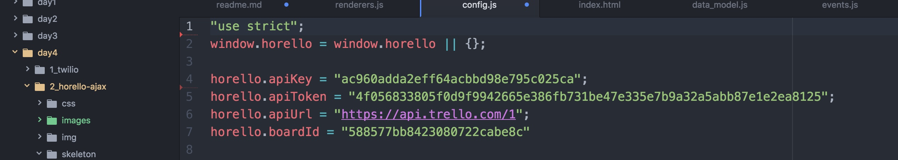
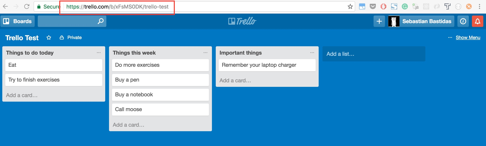

# Horello continued: APIs and AJAX

## Introduction

During the first half of this week, you have been creating a functioning version
of Trello in HTML without a connection to any server. You can add cards, but
they will get deleted if you refresh the page. Today, we are going to use the
Trello API as a backend for our app so our changes are stored for posterity.

Every action like `adding a card` or `changing a title` needs to be sent to the
backend now, so it can save our changes. If a user deletes a card, we have to
remove it from our front-end and from the backend too, making a `DELETE` request
to the API.

To get an idea on how the project works, visit the final version of the project [here](http://horizons-school-of-technology.github.io/week02/day4/2_Horello-ajax/solution/index.html).

# Section 1

## Step 1: Warmup

To start, we are going to create some data on the page from the console and
display it onto a Horello board. Open `index.html` and the console.

Paste the following code into the console. This creates a list with "id" of "1"
and the name "My first list".

```javascript
var list1 = new horello.List("1", "My first list");
```

There is a global object called `board` that contains the whole Horello board.
Add this new list to the `board ` object:

```javascript
board.lists.push(list1);
```

Finally, refresh the board to display it on the screen.  When we make a change
to the board later on in this project, we will need to rember to call this
function!

```javascript
horello.refresh(board);
```

You should see this:


Now that we have a list, we want to add a card to it. We follow a similar
process to add a card to the list. First, we have to create the card. The card
takes in a `cardId`, `cardName`, `description`, and `listId`. Then we have to
push it into our list, adding it to the list's `cards` array, and re-render to
display it.

```javascript
var card1 = new horello.Card("1", "Finish exercises", "Finish doing memoize.");
list1.cards.push(card1);
horello.refresh(board);
```

This is how your board should look now.


We have setup all the logic that takes the board, lists and cards and shows them
up on the screen so you can focus on getting data back and forth from Trello with
ajax. Whenever you do a request and get data for cards, follow the same process
of creating a `new Card()` adding them to the list, and so on.

Try adding more lists and cards into your console and displaying them to the
board.  Don't forget to push the newly created lists into the board by doing
`board.lists.push(someList);` and cards to lists by doing
`someList.cards.push(card)` Refresh the board `horello.refresh(board);` every
time you add a new card.

Here's our test board we generated using these steps:


Ready to start working? head over to `index.html` and un-comment the line that
says `board = realData()` your code on `index.html` should look like this:


## Step 2: Setting up Trello

To be able to use Trello and save your board data to their backend, you need to
create an account, and get a `KEY` and `TOKEN` for our application. This allows
Trello to identify your app and know what boards it has access to.

1. Head over to http://www.trello.com and sign-up/log-in to your Trello account.
1. Navigate to the [Trello
   Developers page](https://developers.Trello.com/get-started/start-building).
1. Click the `Get your Application Key` button in the first section of
   the page. Copy this key and paste it into a file you will create called `config.js` in your js folder. We are not providing the file because we don't want git to track
   the API credentials for your accounts.

  

   An API key is a way of identifying your app. Every time you make a request, you
   will have to send it and Trello will know its your app trying to access the backend.

1. Generate a token manually by clicking on the `Token` link on that page. A Token allows
   Trello to verify that it is really your app is making the request and not someone else.
   Why is the API KEY not enough? Because the API KEY is public and the TOKEN is private.

  

1. Click "Allow" on the authentication screen.
1. Copy this token and paste it into `config.js` into a property called `horello.apiToken`.

By now, this is how your `config.js` file should look.

  

**Creating test data**

1. Head back to http://www.Trello.com
1. Create a new board and add some lists and cards to it.

  

1. Copy the URL from your browser. The current url you are on should looks something like this `https://Trello.com/b/xFsMS0DK/Trello-test` (The part highlighted in red in the previous picture)
1. Add `.json` at the end of that url. (It should look like `https://Trello.com/b/xFsMS0DK/Trello-test.json`.) These are the results you should see:

  

  (Your output may look different if you're not using an extension to format
  JSON.)

1. Copy the id of the board that is listed at the very beginning of the JSON
   output. For example, the board id below is `cc52060cf01c8040340937e7`:

  ```javascript
  {"id":"cc52060cf01c8040340937e7",...
  ```

## Step 3: Getting familiar with the API

We are finally ready to make requests and get data for the boards. This is how a
GET request would look like to get information for a board.

```
$.ajax('https://api.Trello.com/1/boards/YOURBOARDIDHERE', {
      data: {
        key: "YOUR KEY",
        token: "YOUR TOKEN",
      },
      success: function(data) { console.log(data) }
    })
```

That request would return an object like the one below, containing all the information
about the board, including its id, name, description and much more.

```
{
  "id":"588577bb8423080722cabe8c",
  "name":"Trello Test",
  "desc":"",
  "url":"https://Trello.com/b/xFsMS0DK/Trello-test",
  "shortUrl":"https://Trello.com/b/xFsMS0DK",
  "prefs":{}
}
```

Now that you know the basics, let's code! Head on to the `data_model.js` file and implement to the `////GET DATA ////` section.

- `Horello.List.prototype.getCard`. Will be provided for you.
- `Horello.Board.prototype.getList` You will have to implement this one.

The comments on `data_model.js` give you more information on how to do it.

If you need help implementing these methods head over to [Trello API
reference](https://developers.Trello.com/advanced-reference). For more info on how
the API works.

### From AJAX to models

Head over to the `//// ADD CARD AND ADD LIST ////` section to implement the methods.

- `Horello.Board.boardFromJSON` should give you an idea on how they should work.
- `Horello.List.listFromJSON` You have to implement this one.
- `Horello.Card.cardFromJSON` And this one.

These methods are used to convert the JSON you get from the API into actual objects
on your code. They should do the same thing we did on the `Warmup` section when
we created all the objects doing `new horello.List()`. They should take in data
and return the newly created `list` object.

## Step 5: Writing to the API

If you can see all the lists and cards on your Horello board, you are ready to start implementing your AJAX calls to perform new actions on the API. Now, we are going implement the code that allows you to edit a card's title and description.

Whenever someone clicks on a card, a modal shows up. If you edit the card and click
on save, `updateCardTitle` and `setDescription` are called. You have to implement
them to make the request to Trello and update the title on the backend.

`horello.Card.prototype.updateCardTitle` Should make a PUT request to the '/cards' endpoint to update the card's title. Don't forget to modify the current card doing  `this.title = titleStr;` so your interface also refreshes!


`horello.Card.prototype.setDescription` Same concept as above.

Now, you are going to implement similar functions that do an API request and refresh the
page when the ajax request ends in success.

`horello.Board.prototype.addList` Whenever a list is added, this function is called.
You should make a POST request to create a new `List` on the backend. On the success callback of this function, remember to call `this.loadListData();` so the lists are refreshed and your new list shows up on the page.

`horello.List.prototype.addCard` Same concept as above.


## BONUS: Step 6: Improvements

These are some of the things that need to be improved in Part 1:
- Rather than passing the authentication information with every single
  request, see if you can simplify this using
  [jQuery.ajaxSetup()](https://api.jquery.com/jquery.ajaxsetup/).
- Add server polling. Whenever you change things in the real Trello, they won't
show up on Horello if you don't refresh the page. Add `polling` which means that
every once in a while, you check the server for new content and update your app.
- Handle errors when calling the API. What happens if you update the text and the
  request fails? Does the card show the previous text? Does it show the updated one,
  even if a refresh will return to the original text? and so on.


# Section 2: Rendering

Remember how on warmup we created our lists by doing `var list1 = new horello.List("1", "My first list")`? Now we are going to implement the code that does this. By doing `card.render()`, you will generate all the needed HTML for that card.

Head over to `renderers`, un-comment the entire file by removing the first and last lines and start rendering!

## BONUS-Bonus

You are on your own now. From HTML all the way to the backend you are going to make
the connections to make the code work. We will give you a couple of hints on how
you can do this.
- Delete card. To be able to delete a card, you should follow these steps:
    1. Add an [X] button to the right upper corner of each card.
    1. Add a listener for that button, so when a user clicks it, it triggers a function   `card.delete();`
    1. Define and the function `horello.Card.prototype.deleteCard` on your `data_model.js` file. This one should make the DELETE request to the Trello API.
    1. Refresh your data so the card disappears.
- Delete list. This one should work similarly to the previous one.
- Move card between lists
    1. To move a card between lists you have to make two requests. One to remove the
    card from the actual list, and one to add it to the newly specified list.
- Move a card inside the list.
