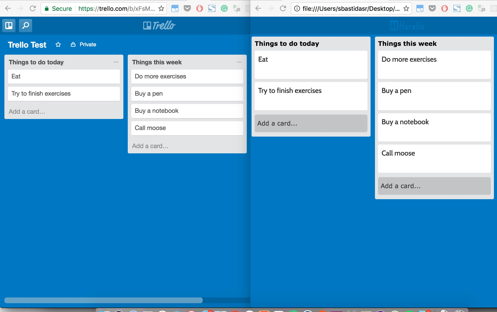
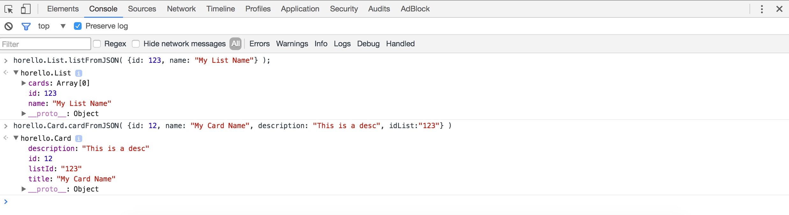
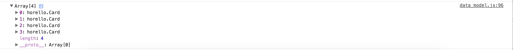

# Horello continued: APIs and AJAX

## Introduction

During the first half of this week, you have been creating a functioning version
of Trello in HTML without a connection to any server. You can add cards, but
they will get deleted if you refresh the page. Today, we are going to use the
Trello API as a backend for our app so our changes are stored for posterity.

Every action like `adding a card` or `changing a title` needs to be sent to the
backend now, so it can save our changes. If a user deletes a card, we have to
remove it from our front-end and from the backend too, making a `DELETE` request
to the API.

By the end of the day, making a change in Trello should update our site and the other way around! Here you can see a side by side capture of both sites. If you add a card on Trello and refresh your site, you should be able to see it in Horello. On this image you can see how data is shared between the two.



To get an idea on how the project works, visit the final version of the project [here](http://horizons-school-of-technology.github.io/week02/day4/2_Horello-ajax/solution/index.html).

# Section 1

## Exercise 1: Warmup

To start, we are going to create some data on the page from the console and
display it onto a Horello board. Open `index.html` and the console.

Paste the following code into the console. This creates a list with "id" of "1"
and the name "My first list".

```javascript
var list1 = new horello.List("1", "My first list");
```

There is a global object called `board` that contains the whole Horello board.
Add this new list to the `board ` object:

```javascript
board.lists.push(list1);
```

Finally, refresh the board to display it on the screen.  When we make a change
to the board later on in this project, we will need to rember to call this
function!

```javascript
horello.refresh(board);
```

You should see this:


Now that we have a list, we want to add a card to it. We follow a similar
process to add a card to the list. First, we have to create the card. The card
takes in a `cardId`, `cardName`, `description`, and `listId`. Then we have to
push it into our list, adding it to the list's `cards` array, and re-render to
display it.

```javascript
var card1 = new horello.Card("1", "Finish exercises", "Finish doing memoize.");
list1.cards.push(card1);
horello.refresh(board);
```

This is how your board should look now.


We have setup all the logic that takes the board, lists and cards and shows them
up on the screen so you can focus on getting data back and forth from Trello with
ajax. Whenever you do a request and get data for cards, follow the same process
of creating a `new Card()` adding them to the list, and so on.

Try adding more lists and cards into your console and displaying them to the
board.  Don't forget to push the newly created lists into the board by doing
`board.lists.push(someList);` and cards to lists by doing
`someList.cards.push(card)` Refresh the board `horello.refresh(board);` every
time you add a new card.

Here's our test board we generated using these steps:


Ready to start working? head over to `index.html` and un-comment the line that
says `board = realData()` your code on `index.html` should look like this:


## Exercise 2: Setting up Trello

To be able to use Trello and save your board data to their backend, you need to
create an account, and get a `KEY` and `TOKEN` for our application. This allows
Trello to identify your app and know what boards it has access to.

1. Head over to http://www.trello.com and sign-up/log-in to your Trello account.
1. Navigate to the [Trello
   Developers page](https://developers.Trello.com/get-started/start-building).
1. Click the `Get your Application Key` button in the first section of the page.
   Copy this key and paste it into
   `week02/day4/2_horello-ajax/skeleton/js/config.js` (you'll see where).

  

   An API key is a way of identifying your app. Every time you make a request, you
   will have to send it and Trello will know its your app trying to access the backend.

1. Generate a token manually by clicking on the `Token` link on that page. A Token allows
   Trello to verify that it is really your app is making the request and not someone else.
   Why is the API KEY not enough? Because the API KEY is public and the TOKEN is private.

  

1. Click "Allow" on the authentication screen.
1. Copy this token and paste it into `config.js` into a property called `horello.apiToken`.

By now, this is how your `config.js` file should look.

  

**Creating test data**

1. Head back to http://www.Trello.com
1. Create a new board and add some lists and cards to it.

  

1. Copy the URL from your browser. The current url you are on should looks something like this `https://Trello.com/b/xFsMS0DK/Trello-test` (The part highlighted in red in the previous picture)
1. Add `.json` at the end of that url. (It should look like `https://Trello.com/b/xFsMS0DK/Trello-test.json`.) These are the results you should see:

  

  (Your output may look different if you're not using an extension to format
  JSON.)

1. Copy the id of the board that is listed at the very beginning of the JSON
   output. For example, the board id below is `cc52060cf01c8040340937e7`:

  ```javascript
  {"id":"cc52060cf01c8040340937e7" ...}
  ```

## Exercise 3: Getting familiar with the API

We are finally ready to get real data from Trello. Open up your console
and try the following `ajax` request:

```
$.ajax('https://api.Trello.com/1/boards/YOURBOARDIDHERE', {
      data: {
        key: "YOUR KEY",
        token: "YOUR TOKEN",
      },
      success: function(data) { console.log(data) }
    })
```

That request will `console.log()` an object like the one below, containing all
the information about the board, including its id, name, description and much
more.

```
{
  "id":"588577bb8423080722cabe8c",
  "name":"Trello Test",
  "desc":"",
  "url":"https://Trello.com/b/xFsMS0DK/Trello-test",
  "shortUrl":"https://Trello.com/b/xFsMS0DK",
  "prefs":{}
}
```

## Exercise 4: Read data from the Trello API

### Convert API JSON responses

Head over to the `ADD CARD AND ADD LIST` section in
`week02/day4/2_horello-ajax/skeleton/js/data_model.js`.

We are going to implement the methods that are used to convert the JSON data you get back from API calls into actual objects on your code. They should do the same thing we did on the `Warmup` section when we created all the objects. For example doing `new horello.List()` should take in data and return the newly created `list` object.

We are going to give you the code for the `horello.Board.boardFromJSON` function to give you an idea on how it should work.

You have to implement both `horello.List.listFromJSON` and `horello.Card.cardFromJSON` to receive objects from data and turn them into List and Card objects.

### Verifying your work
To be sure your code works, call both functions on your console this way:
`horello.List.listFromJSON( {id: 123, name: "My List Name"} );` This one should return a list with the correct attributes.
Calling `horello.Card.cardFromJSON( {id: 12, name: "My Card Name", description: "This is a desc", idList:"123"} )` on the console should return a card object to the console. The capture below shows both lines of code being called.



### Fetch JSON data from API

Head over to the `GET DATA` section in
`week02/day4/2_horello-ajax/skeleton/js/data_model.js`.

The first function: `horello.Board.prototype.loadListData` is already implemented and it should give you an idea on how to implement the next one. This one brings an array of lists for your board.

Implement `horello.List.prototype.loadCardData`. This function should make a GET request to get the cards that belong to a list. If we were trying to get the cards for the list with id "123123", our URL for the request would look like this: "list/12312/cards". You can look at the code in the function above for reference. The difference on this one is the success part of the function. When successful this function should convert al the cards it gets from the API and parsing them using `cardFromJSON`. It should also refresh the board using `horello.refresh(board);`

### Verifying your function.
Up to this point, the best way to verify your AJAX code is working is logging the `this.cards` array at the end of the success part of the function to the console. This should log and array of cards that looks like capture below. You may have a different number of cards depending on the cards you created directly on Trello. But it *should* be an array of `Card` objects



If you need help implementing these methods head over to [Trello API
reference](https://developers.Trello.com/advanced-reference). For more info on how
the API works.

## Verifying your code works up to this point

If you load your page and it loads lists and cards, you are good to go! It should contain the same data from your Trello board.


## Exercise 5: Writing data to the Trello API

Head over to the `SET TITLE AND DESCRIPTION ON CARDS` section in
`week02/day4/2_horello-ajax/skeleton/js/data_model.js`.

Now, we are going implement the code that sends updates to the server via AJAX
when a card's title or description is updated.

When you click on save on the edit card modal
`horello.Card.prototype.updateCardTitle` and
`horello.Card.prototype.setDescription` are called.

### `horello.Card.prototype.updateCardTitle()`

We are giving you the code to modify the title of the current card. This is what the function should do to modify the title:

1. Modify the title of the current card

  ```
  this.title = titleStr;
  ```

1. Make an AJAX `PUT` request to the `/cards` endpoint to update the card's
   title.

### `horello.Card.prototype.setDescription()`

You are going to implement this function to update the description of the current card. It should take the following steps:

1. Modify the description of the current card.
1. Make an AJAX `PUT` request to the `/cards` endpoint to update the card's
   description on the backend

### Verifying your work
To check your code works click on a card, edit it and save it. Refresh the page. If the card was updated, you are good to go!

   

### `horello.Board.prototype.addList()`
TODO rewrite this

Whenever a list is added, this function is called.  You should make a POST
request to create a new `List` on the backend.  On the success callback of this
function, remember to call `this.loadListData();` so the lists are refreshed
and your new list shows up on the page.

### `horello.List.prototype.addCard()`

TODO flesh this out
Same concept as above.

## Exercise 6: Rendering

During the warmup phase we were able to update our page by calling

```javascript
horello.refresh(board);
```

When we call `.refresh()`, we generate new HTML for the page using `.render()`
defined on `horello.Card`, `horello.List` and `horello.Board`. `.render()`
returns a string that contains the HTML for the current `Card`, `List` or
`Board`.

Head over to `week02/day4/2_horello-ajax/skeleton/js/renderers.js`, delete the
lines that say `DELETE THIS LINE`. And start implementing your renderers replacing the `YOUR CODE HERE` parts.


### Verifying your code
To check if your code works, head over to the page and refresh it. It should like the original Horello we started working on today!


## Bonus: Exercise 7: AJAX Improvements

Make these improvements to make to the AJAX process:

- Rather than passing the authentication information with every single
  request, see if you can simplify this using
  [jQuery.ajaxSetup()](https://api.jquery.com/jquery.ajaxsetup/).
- Periodically "poll" the server for new data by using `setInterval()`.
  Fetch new data via AJAX and update the page every 30 seconds.
- Handle errors when calling the API. What happens if you update the text and
  the request fails? Does the card show the previous text? Does it show the
  updated one, even if a refresh will return to the original text? and so on.


## Double Bonus: Exercise 8: UI Improvements

Implement these UI Implement:

- Delete card. To be able to delete a card, you should follow these steps:
    1. Add an [X] button to the right upper corner of each card.
    1. Add a listener for that button, so when a user clicks it, it triggers a function   `card.delete();`
    1. Define and the function `horello.Card.prototype.deleteCard` on your `data_model.js` file. This one should make the DELETE request to the Trello API.
    1. Refresh your data so the card disappears.
- Delete list. This one should work similarly to the previous one.
- Move card between lists
    1. To move a card between lists you have to make two requests. One to remove the
    card from the actual list, and one to add it to the newly specified list.
- Move a card inside the list
