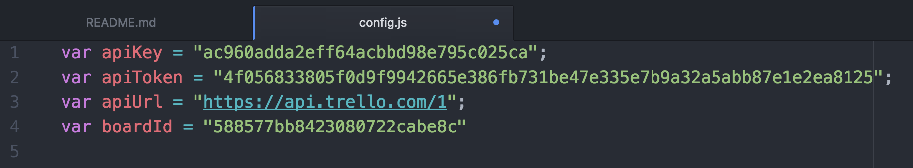

# Horello continued: APIs and AJAX

## Introduction

During the first half of this week, you have been creating a functioning version
of Trello in HTML without a connection to any server. You can add cards, but
they will get deleted if you refresh the page. Today, we are going to use the
Trello API as a backend for our app so our changes are stored for posterity.

Every action like `adding a card` or `changing a title` needs to be sent to the
backend now, so it can save our changes. If a user deletes a card, we have to
remove it from our front-end and from the backend too, making a `DELETE` request
to the API.

By the end of the day, making a change in Trello should update our site and the other way around! Here you can see a side by side capture of both sites. If you add a card on Trello and refresh your site, you should be able to see it in Horello. On this image you can see how data is shared between the two.


## Specifications

This is a description of all provided functions for this assignment. The only
one you will need for all parts up till the bonus is `renderBoard(board)`. You
will need to use the rest of the functions for the Bonus parts.

**Note** that `@params` describes the function parameters (what is passed into a function)

##### `renderBoard(board)`

Renders a Horello board at `#boardAnchor` in `index.html`.

@params:
    - `board`: an `Object` that contains the following keys:
        - `lists`: array of list objects (example of list object below)
            ```js
            {
              closed: true,
              id: "5885963ac15ad6bf1e892155",
              idBoard: "588577bb8423080722cabe8c",
              name: "I just created a new list!",
              pos: 16383.75,
              subscribed: false
            }
            ```
        - `cards`: array of card objects (example of card object below)
            ```js
            {
              "id": "588944b18f80bcdc5e06a1c6",
              "checkItemStates": null,
              "closed": false,
              "dateLastActivity": "2017-01-26T00:37:05.858Z",
              "desc": "Using the Trello API is fun and easy!",
              "descData": null,
              "idBoard": "588577bb8423080722cabe8c",
              "idList": "5885963ac15ad6bf1e892155",
              "idMembersVoted": [...],
              "idShort": 23,
              "idAttachmentCover": null,
              "manualCoverAttachment": false,
              "idLabels": [...],
              "name": "I just created a new card!",
              "pos": 2,
              "shortLink": "qDQGAFNh",
              "badges": {...}
            }
            ```
        - `id`: id of the board

##### `refreshStatic()`

Adds event handlers for the following actions:

- adding a list
- editing a card
- saving a modal

##### `refresh()`

Adds event handlers for the following actions:

- adding a card
- opening a modal

##### `addCard(card)`

Add a card to your Horello board given a card object

##### `addList(list)`

Add a list to your Horello board given a list object

## Part 1: Setting up Trello

To be able to use Trello and save your board data to their backend, you need to
create an account, and get a `KEY` and `TOKEN` for our application. This allows
Trello to identify your app and know what boards it has access to.

1. Head over to http://www.trello.com and sign-up/log-in to your Trello account.
1. Navigate to the [Trello Developers Page](https://developers.Trello.com/get-started/start-building).
1. Click the `Get your Application Key` button in the first section of the page. Copy this key and paste it into
   `week02/day4/2_horello-ajax/skeleton/js/config.js`.

	  

    An API key is a way of identifying your app. Every time you make a request, you
    will have to send it and Trello will know its your app trying to access the backend.

1. Generate a token manually by clicking on the `Token` link on that page. A Token allows
   Trello to verify that it is really your app is making the request and not someone else.
   Why is the API KEY not enough? Because the API KEY is public and the TOKEN is private.

    

1. Click "Allow" on the authentication screen.
1. Set your local API token in the `config.js` file. (`var apiToken = "YOUR API TOKEN HERE";`)

By now, this is how your `config.js` file should look.

    

### Generating Test Data

In this section, we start by creating some data manually on Trello. After creating the data, we check that we can retrieve it using AJAX.

1. Head back to http://www.trello.com
1. Create a new board and manually add some lists and cards to it.
1. Copy the URL from your browser. The current url you are on should look something like this `https://Trello.com/b/xFsMS0DK/Trello-test` (The part highlighted in red in the following picture)

    

1. Add `.json` at the end of that url. (It should look like `https://Trello.com/b/xFsMS0DK/Trello-test.json`.) These are the results you should see:

  

  (Your output may look different if you're not using an extension to format
  JSON.)

1. Copy the id of the board that is listed at the very beginning of the JSON
   output. For example, the board id below is `cc52060cf01c8040340937e7`:

  ```javascript
  {"id":"cc52060cf01c8040340937e7" ...}
  ```

  Note: The id for the response in the picture above is "588577bb8423080722cabe8c";

## Part 2: Getting familiar with the API

We are finally ready to get real data from Trello. Open up your console
and try the following `ajax` request: (Don't forget to insert your key,
token and boardId in the corresponding places)

```
$.ajax('https://api.Trello.com/1/boards/YOURBOARDIDHERE', {
  data: {
    key: "YOUR KEY",
    token: "YOUR TOKEN",
    cards: 'all',
    lists: 'all'
  },
  success: function(data) { console.log(data) }
});
```

That request will `console.log()` an object like the one below, containing all
the information about the board, including its id, name, description, arrays of
lists and cards and much more.

```
{
  "cards": Array[],
  "lists": Array[],
  "id": "588577bb8423080722cabe8c",
  "name": "Trello Test",
  "desc": "",
  "url": "https://Trello.com/b/xFsMS0DK/Trello-test",
  "shortUrl": "https://Trello.com/b/xFsMS0DK",
  "prefs": {}
}
```

## Part 3: Read data from the Trello API

### Convert API JSON responses

In this part we will take the response from the AJAX request and
use it to render our Horello board.

Head over to the `render()` function in `js/script.js`.

Use the AJAX request you constructed in Part 2 and paste it into the `render()`
function. Then on success you want to take the response data and pass
this object into the `renderBoard` function.

## Checkpoint

If you load your page and it loads lists and cards, you are good to go! It should contain the same data from your Trello board.


## Part 4: Writing data to the Trello API

Head over to the `createList`, `createCard`, and `updateCard` functions in
`src/js/events.js`.

Now, we are going implement the code that sends updates to the server via AJAX
when a card is updated.

When you click on save on the edit card modal `updateCard` is called.

### `updateCard()`

This function takes in a title, description, and cardId
and makes a `PUT` request to the `/cards` endpoint to update the card in Trello

1. Make an AJAX `PUT` request to the `/cards` endpoint to update the card's
   title and description.

1. On the `success` callback call the `render()` function to update the
card on Horello with the new title/description.

### Verifying your work
To check your code works click on a card, edit it and save it. Refresh the page. If the card was updated, you are good to go!

   


## Adding Lists and cards
Now, we are going to implement the functionality to add new lists and cards to your Horello app. Whenever you create a new `list` or `card`, it should be sent to the backend and saved on the Trello API.

### `createList()`

This function is called whenever a user clicks on `add list`, gives it a name, and saves it. This function makes a POST request to the `/lists` endpoint, sending the new list's data to the backend to create a new `List`. On the success callback of this function, we call `render()` so all the lists are refreshed and your new list shows up on the page.

### `createCard()`

Implement `addCard` to take in a `name` and `listId` and send data to the Trello API and create a new Card. This function is very similar to the one above, but instead makes a POST request to the `/cards` endpoint and sends new data.

Remember to call `render()` after making the request to refresh all the cards on list and show the new card that was added to it.

### Verifying your work
To check your code works click on add-card, give it a name and save it. Refresh the page. If the card was created, you are good to go!

   

## Bonus: Part 5: AJAX Improvements

- Rather than passing the authentication information with every single
  request, see if you can simplify this using
  [jQuery.ajaxSetup()](https://api.jquery.com/jquery.ajaxsetup/).
- Periodically "poll" the server for new data by using `setInterval()`.
  Fetch new data via AJAX and update the page every 30 seconds.
- Handle errors when calling the API. What happens if you update the text and
  the request fails? Does the card show the previous text? Does it show the
  updated one, even if a refresh will return to the original text? and so on.

## Double Bonus: Part 8: UI Improvements

- Delete card. To be able to delete a card, you should follow these steps:
    1. Add an [X] button to the right upper corner of each card.
    1. Add a listener for that button, so when a user clicks it, it triggers a function `deleteCard`
    1. Define and the function `deleteCard(cardId)` on your `events.js` file. This one should make the DELETE request to the Trello API.
    1. Refresh your data so the card disappears.
- Delete list. This one should work similarly to the previous one.
- Move card between lists
    1. A move is two operations: a `remove` followed by an `add`. One to remove the card from the actual list, and one to add it to the newly specified list.
- Move a card inside the list
