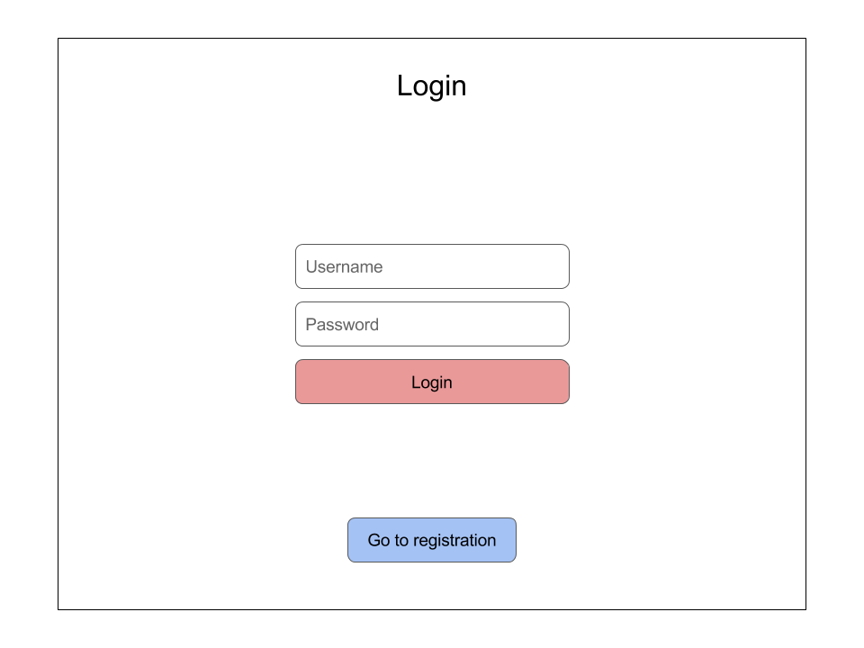
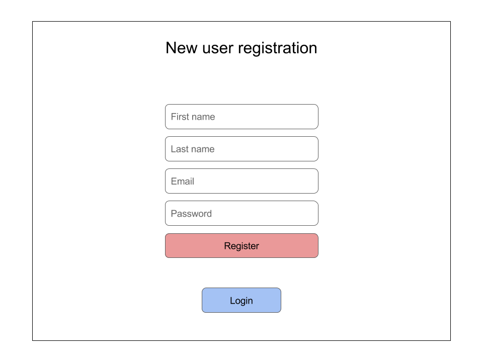
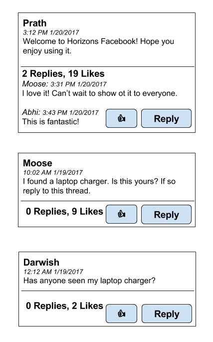

# Facebook Exercise

<figure style="text-align: center;"><figcaption>*Logo Design **Inspired by** Zinger*</figcaption></figure><br/>

At this point, you've learned about JavaScript essentials, HTML and CSS with Bootstrap, DOM manipulation with jQuery, and API usage with AJAX. It's time to put all these skills into action. Ready?

**Instructions:**

1. Build Facebook

...okay, we'll give you a _little_ more than that.

## Introduction

Building Facebook is your first test of design patterns and skills in DOM manipulation and AJAX requests in a less guided scenario.

_Focus on implementing the core functionality first, and worry about styling and CSS later._ Making it work is more important than making it look good. If you are spending most of your time writing your CSS, you are not using it in the best way. Form follows function!

_Use the design patterns you know, but make sure you understand what you are building._ You will find that many of the skills you learned in building Horello will apply here: creating data models and rendering HTML bits in jQuery for each component are good ideas to tackle this exercise. At the same time, this doesn't mean you necessarily need all the complexity of Horello within your initial attempts at building Facebook. If it makes more sense to you to view the problem with a different approach, use it.

_Stay organized._ Outlining the flow of your Facebook implementation or taking each component below one-by-one is a good idea. Well-structured code is easier to debug, easier to write, and easier for other people to understand.

That's all. Move fast and break things! *

<sub>_* not the server though, thanks_</sub>

## Required Components

The components we want you to build are below. We recommend you approach each one as a step building off the other, but you may take the components in any order you'd like. Keep in mind that many of these components rely on your implementation of registering and authenticating a user.

1. **Registration**: You will need to allow a user to fill out a form to register with email, password, first and last name, and birthday.

2. **Login**: You will need to present existing users with a login that authenticates with email and password. Upon successful login, our server will return you a token to pass into subsequent requests.

3. **Posts**: For authenticated users, you will need to present a Newsfeed with Post objects returned by our server and a component to allow users to submit posts to the Newsfeed. Posts are plain-text and only have information on the poster's name and time submitted.

4. **Likes**: Each post will need to have a Like button to allow authenticated users to Like posts on the Newsfeed. Likes are stored as an array on each Post object and have information on the user who Liked the post.

5. **Comments**: Each post will also need to allow users to Comment on Post objects - comments will also be stored as an array on each Post object and contain the comment contents and information on the commenter.

6. **Bonus: Chat**: See *Using Sockets* for more information on how to implement Chat. You will be adding a chat section to your Facebook site to have a central chat feature for all users on your site.

7. **Bonus: Relative Date**: Using `https://momentjs.com/` figure out a way to add relative time to all of your posts. So instead of an absolute date a post would have a date relative to the current date (i.e. posted 5 minutes ago).

Yes, it's a lot - but if Mark Zuckerberg can do it, you can too!

## Instructions
These instructions are very minimal in nature and should only be used as a guide to creating your Facebook newsfeed **(they should not be followed religiously as the final app should be your own creation)**. Additionally, the *pictures* throughout this guide are merely visual aids to help you understand and visualize each step, so **do not** imitate the designs used for the images.

1. Let's create the files required to start making your Facebook Newsfeed:

* `/facebook/index.html`: This will be the main page of your app where you will write all of the necessary `HTML`.
* `/facebook/css/style.css`: This will be our primary style sheet for the app. You can add more stylesheets if you would like.
* `/facebook/js/script.js`: We will write all of our `Javascript & jQuery` in here.

1. Add starter `HTML` code for your `index.html` file

```HTML

<!DOCTYPE html>
<html>
<head>
  <meta charset="utf-8">
  <title>Horizons Facebook</title>
  <!-- CSS files for Bootstrap -->
  <!-- UNCOMMENT IF NEEDED -->
  <!-- <link href="https://maxcdn.bootstrapcdn.com/bootstrap/3.3.7/css/bootstrap.min.css" rel="stylesheet" integrity="sha384-BVYiiSIFeK1dGmJRAkycuHAHRg32OmUcww7on3RYdg4Va+PmSTsz/K68vbdEjh4u" crossorigin="anonymous"> -->
</head>
<body>
  <!-- YOUR CODE HERE -->
  Hello, World!

  <!-- jQuery -->
  <script
  src="https://code.jquery.com/jquery-3.1.1.min.js"
  integrity="sha256-hVVnYaiADRTO2PzUGmuLJr8BLUSjGIZsDYGmIJLv2b8="
  crossorigin="anonymous"></script>
  <!-- JavaScript files for Bootstrap -->
  <!-- UNCOMMENT IF NEEDED -->
  <!-- <script src="https://maxcdn.bootstrapcdn.com/bootstrap/3.3.7/js/bootstrap.min.js" integrity="sha384-Tc5IQib027qvyjSMfHjOMaLkfuWVxZxUPnCJA7l2mCWNIpG9mGCD8wGNIcPD7Txa" crossorigin="anonymous"></script> -->
</body>
</html>
```

### Login

1. Write the front-end code the login section of your Facebook site. One way to create the login form is to use the `<form>` element in `HTML` and ask for `email` and `password`.


1. Using `AJAX` take the two form elements and `POST` them to the `/users/login` endpoint.
`url: https://horizons-facebook.herokuapp.com/api/1.0/users/login`. Refer to the **API Reference** to see what the request/response should look like.

```javascript

$.ajax('url-goes-here', {
  method: 'POST',
  success: function(data) {
    // data will be the response data that is
    // returned by the endpoint. use this to
    // access the token for future authorization.

    // data.response.token will give you access
    // to the AUTH_TOKEN
  },
  data: {
    email: String,
    password: String
  }
});
```

1. If all goes well you will get back a `JSON` response that looks something like: `{success: true, response: {id: USER_ID, token: AUTH_TOKEN}}`. You should store the `AUTH_TOKEN` in a local variable as you will need access to it for future requests.

1. You can now hide this (login/registration) section of the `HTML` and reveal the newsfeed.

### Register

1. Add `HTML` to your `index.html` file to build a registration form for new users. A new user **must** have a first name (*fname*), last name (*lname*), email address (*email*), and a password (*password*).


1. Much like login you should create a form like the one above with the four *required* properties, and when the `Register` button is pressed the `AJAX POST request` to `/users/register` should occur (with fname, lname, email, and password).

1. On success the `AJAX` response should contain `{success: true}` (and that's it).

1. Now the Login section should reveal itself while the Register section should hide the form.

### List Posts

1. Once you have tackled the login/register pages, the next step is to retrieve and list posts currently on the database.


1. Refer to the **API Reference** to figure out what a `GET /posts` request/response should look like. You only need to include your `token` in the request header.

1. The response to your `AJAX` request will be in `JSON`, and your job is to parse the object and convert all of the posts into `HTML`. Recall the `jQuery` syntax used to `.append()` cards to your list; similarly, parse the response object into useful post information (i.e. post creation date, poster, post content...).

1. Be sure to add a like and comment/reply button as we will be implementing that functionality later on.

### Post Posts


1. In order to publish posts onto the database you should first create an input box with a submit/post button.

1. When the click event is triggered you should call the `POST /posts` endpoint to post your literary masterpiece from the input box. Use the **API Reference** to figure out what your request/response should look like.

### Likes/Comments

1. At this stage in the guide you have most likely mastered `AJAX Requests/Front-End Programming`. So refer to the **API Reference** guide to figure out how to like/comment on existing posts.

1. Make sure you have a `Like` button and a `Comment` button.

1. Remember that `POSTing` to the `/posts/comments/:id` endpoint requires a message, so you need to also add UI functionality to get user input for a comment.

1. Another thing to note is that the `/posts/likes/:id` endpoint just toggles the current state of the like button.

### Update Page

1. We have also learned about `Asynchronous` behaviour, and have been introduced to functions such as `setInterval` and `setTimeout`.

1. Since the `/posts API` endpoint has all of the required information for the newsfeed (i.e. posts & comments & likes) we should constantly update our newsfeed by sending out `AJAX requests` to this endpoint.

1. In order to minimize traffic at that endpoint requests should be submitted at least 30 seconds apart.

### Logout

1. When ending the session be sure to *logout*. The `/users/logout` takes in your AUTH_TOKEN as parameters and (if successful) responds with `{"success": true}`.

# API Reference

Below are the live server specifications for accessing our "Facebook" API. All routes marked by a lock symbol (🔒) require you to pass in the token that you receive upon successful login. This token changes across users and sessions! Store it for authenticating each request as necessary. All authenticated requests are also rate-limited to 60/minute. _If you exceed the rate limit, please check the amount of requests you are sending._

⚠️ All requests below with a 🔒 next to the title require authentication.

### `POST` Register User
`url: https://horizons-facebook.herokuapp.com/api/1.0/users/register`


You must create your own account before accessing the login routes. In order to create a new user you should submit a `POST` request to the given url. The request must have the following information:
```javascript

{
  "fname": String, // The first name of the registering user
  "lname": String, // The last name of the registering user
  "email": String, // The email of the registering user, used for later authentication. Must not be the email of an existing user
  "password": String // The plaintext password of the registering user, used for later authentication. Don't worry, we've enforced strict HTTPS over the API and we hash and salt your password
}
```
Note that you can not make multiple user accounts with the same email, and all above information must be present in the request. If you do either of those things then the request will return a `400 Bad Request` error.

A successful user account registration request will result in the following **success** response:

```javascript

{
  "success": true,
  "response": {
    "__v": 0, // You may safely ignore __v
    "fname": String, // first name
    "lname": String, // last name
    "email": String, // email address
    "token": null, // unique token
    "password": String, // password
    "_id": String
  }
}
```

**Success Response**: 200 - `{success: true}`

**Failure Responses**:

* 400 - `{error: "Incomplete register definition."}` - You may have forgotten to pass in one or more of the required fields for registration. Check the spelling of your fields and make sure you are sending all your information in non-undefined values.

* 500 - `{error: "Failed to hash password."}` - Call a TA over. The password you sent is having issues being hashed on our server.

* 500 - `{error: "Failed to save the new user."}` - Call a TA over. You may be malformatting your request or the database may be overloaded.


### `POST` Login
`url: https://horizons-facebook.herokuapp.com/api/1.0/users/login`

This is the route you use for authentication. To login to your Horizons Facebook account you should submit a `POST` request the the above endpoint. The body of your request should contain the `email` and the `password` of the user that wants to login.

```javascript

{
  "email": String, // Email that identifies the user, set upon registration.
  "password": String // Password that verifies the user, set upon registration.
}
```

**Success Response**: 200 - `{success: true, response: {id: USER_ID, token: AUTH_TOKEN}}`

**Failure Responses**:

* 301 - Redirect to `GET /login` - `{error: "Login failed."}` - One or more of your authentication details was incorrect. Make sure you are sending the correct email and password you set upon registration and that these values are defined.

* 500 - `{error: "Failed to serialize user."}` - Call a TA over. There is an issue with your user account in the database.

### `GET` Login
**Note that this is a `GET` request while the one above is a `POST` request**

`url: https://horizons-facebook.herokuapp.com/api/1.0/users/login`

**This route will always return an error**; it is the URL that you are redirected to upon an unsuccessful login. If you are getting this every time, make sure that **a)** you are sending the correct email and password and **b)** you are POSTing login information to the login route.

**Response**: 401 - `{error: "Login failed."}`

### `GET` Posts Error
`url: https://horizons-facebook.herokuapp.com/api/1.0/posts/error`

You should not be calling this request manually; you will be redirected to this route if any of your `/posts` requests fail or you are not authorized to access the post routes.

**Response**: 401 - `{error: "Action not allowed. Please authenticate."}`

### `GET` Posts 🔒
`url: https://horizons-facebook.herokuapp.com/api/1.0/posts`


Returns the 10 most recent posts posted by users from the site. This is equivalent to `/posts/1`. The format for posts you will get back looks like the following:

**Success Response**: 200

```javascript

{
  "success": true,
  "response": [
    {
      "_id": "588afdbd7f87100011bce3f6",
      "poster": {
        "id": "588ab0967f87100011bce3f1",
        "name": "prath desai"
      },
      "content": "testing123",
      "createdAt": "2017-01-27T07:58:53.757Z",
      "__v": 0,
      "comments": [],
      "likes": []
    }
  ]
}
```

This is an example of a response with one post that has no comments and no likes. The `response` property, and each `comments` and `likes` property of a Post object are arrays. Make sure you manage this when handling the response of posts!

**Schema/Breakdown of `response`:**

* Response is an array of objects representing posts, all of which have:
	* `_id`:  The ID of the post.
	* `poster`: An object representing a user, which has:
		* `id`: The ID of the user/poster.
		* `name`: The first and last name of the user/poster.
	* `content`: The text content of the post.
	* `createdAt`: A date string representing the time the post was posted.
	* `__v`: You may safely ignore `__v`.
	* `comments`: An array of objects representing comments, which have:
		* `poster`: An object representing a user, which has:
			* `id`: The ID of the user/poster.
			* `name`: The first and last name of the user/poster.
		* `content`: The text content of the comment.
		* `createdAt`: A date string representing the time the comment was posted.
	* `likes`: An array of objects representing users that have liked the post, all of which have:
		* `id`: The ID of the user that liked the post.
		* `name`: The first and last name of the user that liked the post.

Both `comments` and `likes` could be empty arrays!

**Failure Responses**:

* 500 - `{error: "Failed to query posts."}` - Call a TA over. There is an issue in retrieving posts from our database.

### `POST` New Facebook Post (a.k.a. post a post) 🔒
`url: https://horizons-facebook.herokuapp.com/api/1.0/posts`

This route posts a new post to the central Newsfeed. This route takes the following required parameters:

```javascript

{
    "token": String, // AUTH_TOKEN
    "content": String // The text content of the new post.
}
```

If the request goes through successfully the API endpoint should respond with `JSON` that looks like this:

```javascript

{
  "success": true,
  "response": {
    "__v": 0,
    "poster": {
      "name": "prath desai",
      "id": "588ab0967f87100011bce3f1"
    },
    "content": "testing123",
    "createdAt": "2017-01-27T07:58:53.757Z",
    "_id": "588afdbd7f87100011bce3f6",
    "comments": [],
    "likes": []
  }
}
```

**Success Response**: 200 - `{success: true}`

**Failure Responses**:

* 400 - `{error: "No post content."}` - Your request did not include the `content` field correctly or you attempted to submit a blank post. Please check your AJAX request and make sure that you are sending your post contents correctly.

* 500 - `{error: "Failed to save the new post."}` - Call a TA over. There is an issue in saving posts to our database.

### `GET` x Amount of Posts

This route returns post objects in the same format as the GET `/posts` request above, but in a way that allows you to select a particular amount of posts from history.

`:x` represents a number that paginates your selection of a group of 10 posts. For example, `/posts/1` will return you the first 10 posts, `/posts/2` will return you the next 10 posts, and `/posts/3` will return you the next 10 posts after that. Posts are sorted by time and higher numbers for `:x` represent posts from longer ago.

Note that if fewer than 10 posts exist, requesting `/posts/2/` will give you back an empty array. The same applies for fewer than 20 posts and `/posts/3` and so on. Any `GET` request for posts from the server will return you a maximum of 10 posts.

**Success Response**: 200 - See above for schema/example of a posts response.

**Failure Responses**:

* 500 - `{error: "Failed to query posts."}` - Call a TA over. There is an issue in retrieving posts from our database.

### `GET` Comments of a Post 🔒
`url: https://horizons-facebook.herokuapp.com/api/1.0/posts/comments/:id`

This route gets all comments of a post by an ID (**of the post**, not the poster's user ID!). You get the post's ID through `GET /posts`, which is returned in each object representing a post as `_id`.

`:id` in this URL represents a 24-character long string that represents a post.

**Success Response**: 200

```javascript

{
  "success": true,
  "response": [
    {
      "_id": "588afdbd7f87100011bce3f6",
      "poster": {
        "id": "588ab0967f87100011bce3f1",
        "name": "prath desai"
      },
      "content": "testing123",
      "createdAt": "2017-01-27T07:58:53.757Z",
      "__v": 1,
      "comments": [
        {
          "createdAt": 1485505479658,
          "content": "this is a comment!",
          "poster": {
            "name": "prath desai",
            "id": "588ab0967f87100011bce3f1"
          }
        }
      ],
      "likes": []
    }
  ]
}
```

**Schema/Breakdown of `response`**:

* `response`: An array of objects representing comments, which have:
	* `poster`: An object representing a user, which has:
		* `name`: The first and last name of the user/poster.
    * `id`: The ID of the user/poster.
	* `content`: The text content of the comment.
	* `createdAt`: A date string representing the time the comment was posted.


Note: This could return an empty array as the `response`! Also note that you may not need this route, as `GET /posts` will already return you the comments associated with each post.

**Failure Responses**:

* 500 - `{error: "Failed to get comments on a post."}` - This may mean that you are passing in an invalid ID for a post. Check to make sure that you are passing the `:id` as part of the URL and that you are passing in the ID for a post, not of a user.

### `POST` Comments 🔒
`url: https://horizons-facebook.herokuapp.com/api/1.0/posts/comments/:id`

This POST route is used to post comments to a post by a post ID (that's a lot of posting). Posting a comment with this route takes the following required parameters:

* `token`: Your `AUTH_TOKEN`
* `content`: The text content of the comment you are posting.

Note: The `:id` you specify must refer to a valid post ID - pass it in as part of the URL, not in the request body. This endpoint expects a `token` and `content`. This is what a successful response should look like:

```javascript
{
  "success": true,
  "response": {
    "_id": "588afdbd7f87100011bce3f6",
    "poster": {
      "id": "588ab0967f87100011bce3f1",
      "name": "prath desai"
    },
    "content": "testing123",
    "createdAt": "2017-01-27T07:58:53.757Z",
    "__v": 1,
    "comments": [
      {
        "createdAt": 1485505479658,
        "content": "this is a comment!",
        "poster": {
          "name": "prath desai",
          "id": "588ab0967f87100011bce3f1"
        }
      }
    ],
    "likes": []
  }
}
```

**Success Response**: 200 - `{success: true}`

**Failure Responses**:

* 500 - `{error: "Failed to post comments on post."}` - This may mean that you are passing in an invalid ID for a post. Check to make sure that you are passing the `:id` as part of the URL and that you are passing in the ID for a post, not of a user.

### `GET` Likes 🔒
`url: https://horizons-facebook.herokuapp.com/api/1.0/posts/likes/:id`

Liking a post always uses `GET` - there is no POSTing likes. Requesting this route will NOT return the existing likes on a post - it will toggle the existing state of whether the currently authenticated user has liked the post corresponding to `:id` or not.

Notice the difference in the new response from the `API` once the `/posts/likes/:id` endpoint has been hit:

```javascript
{
  "success": true,
  "response": {
    "_id": "588afdbd7f87100011bce3f6",
    "poster": {
      "id": "588ab0967f87100011bce3f1",
      "name": "prath desai"
    },
    "content": "testing123",
    "createdAt": "2017-01-27T07:58:53.757Z",
    "__v": 2,
    "comments": [
      {
        "createdAt": 1485505479658,
        "content": "this is a comment!",
        "poster": {
          "name": "prath desai",
          "id": "588ab0967f87100011bce3f1"
        }
      }
    ],
    "likes": [
      {
        "name": "prath desai",
        "id": "588ab0967f87100011bce3f1"
      }
    ]
  }
}
```

### Using Sockets

Read this when you are working on your Chat component! Implementing Chat will require you to use a protocol you have not used before: WebSockets. WebSockets is a realtime, event-driven protocol that allows us to create applications like chat that are extremely responsive. We will interface with WebSockets using a client library called [Socket.IO](http://socket.io) - import their library to your page with the following line:

**NOTE:** Learning to use the Sockets library will be an exercise in reading documentation and determining how to use it successfully.

`<script src="https://cdn.socket.io/socket.io-1.4.5.js"></script>`

Our Sockets server lives on port 3000 of the base API URL, which means it can be accessed at https://horizons-facebook.herokuapp.com/socket.io.

Upon connecting successfully to the Sockets server, please emit a new `authentication` event in the following format: `{token: AUTH_TOKEN}`. You have 5 seconds after connecting to the Sockets server to present your authorization token you received upon login, or you will be disconnected from the server. If you successfully authenticate, you will receive the `authenticated` event and will be ready to begin sending messages.

All new messages are sent by emitting the `message` (send the message you are sending in plain text, without an object); if you are authorized, our Sockets server will broadcast the new message in the following form: `{username: *username*, message: *the message*}`.
